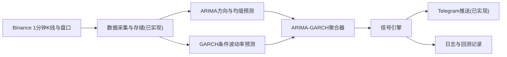

# 基于 ARIMA-GARCH 模型的 10 分钟事件合约预测工具实现计划

## 1. 项目目标

本计划用于在现有 ARIMA 预测提醒工具基础上，新增 GARCH 波动率模型，并将 ARIMA 与 GARCH 的结果聚合为更清晰、更保守的 10 分钟事件合约方向信号。

本阶段只扩展预测与信号判断能力，不改变工具的风险边界：

- 不自动下单。
- 不绕过 Binance 事件合约的地区、账户或合规限制。
- 不改变现有数据采集和 Telegram 推送的主要实现。
- 不引入除 GARCH 与 ARIMA-GARCH 聚合以外的机器学习模型。

目标工作流如下：



聚合后的工具仍输出“涨 / 跌 / 观望”三类结果。只有当聚合方向明确、置信度达到阈值、成交量与盘口过滤通过、冷却规则允许时，才输出开仓提醒信号并推送 Telegram。

## 2. 当前系统可复用能力

现有系统已经完成 ARIMA 工具的主要闭环，后续实现应优先复用这些模块。

### 2.1 数据采集与存储

可复用文件：

- `src/data/binance_klines.py`
- `src/data/binance_orderbook.py`
- `src/data/market_data_source.py`
- `src/data/market_data_storage.py`
- `src/data/live_collector.py`
- `src/data/download_klines.py`
- `src/data/collect_live.py`

GARCH 第一版不需要新增数据来源。它应与 ARIMA 使用同一批 1 分钟 K 线，默认基于 `close` 价格生成的对数收益率序列建模。

### 2.2 ARIMA 预测

可复用文件：

- `src/models/arima_predictor.py`
- `src/models/__init__.py`

现有 `ARIMAPredictionResult` 已包含：

- `predicted_cumulative_return`
- `direction`
- `interval_lower`
- `interval_upper`
- `residual_volatility`
- `model_order`
- `current_price`
- `prediction_horizon_minutes`
- `error_code`
- `error_message`

后续应尽量让 ARIMA-GARCH 聚合结果兼容这些字段，减少信号层改动。

### 2.3 信号引擎

可复用文件：

- `src/signals/signal_engine.py`

当前信号层已经实现以下置信度组件：

- 预测幅度 `magnitude`
- 信噪比 `snr`
- 预测区间一致性 `interval`
- 成交量过滤 `volume`
- 盘口价差过滤 `spread`
- 盘口不平衡 `imbalance`

其中 `snr` 当前使用 ARIMA 残差波动率。GARCH 的最小接入点就是用条件波动率补充或替代该波动率输入，使信号引擎在高波动环境下降低低质量方向信号。

### 2.4 实时运行与回测

可复用文件：

- `src/live_runner.py`
- `src/backtest/rolling_backtest.py`
- `src/backtest/run_backtest.py`

`src/live_runner.py` 已负责实时数据、模型预测、信号评估和 Telegram 推送。后续应把单一 ARIMA 预测替换为 ARIMA-GARCH 聚合预测，但不重写实时循环。

`src/backtest/rolling_backtest.py` 已支持 `predict_fn` 注入。后续应优先通过新的聚合预测函数接入回测，保留现有无未来函数的滚动窗口逻辑。

### 2.5 配置、通知与文档

可复用文件：

- `src/utils/config.py`
- `.env.example`
- `src/notify/telegram.py`
- `README.md`
- `docs/RISK_DISCLAIMER.md`

新增配置应沿用现有 `.env` 与 `Settings.from_environ()` 风格。Telegram 消息可以通过扩展 `trigger_summary` 展示 ARIMA-GARCH 来源，第一版不必重写通知模块。

## 3. 功能边界

### 3.1 本次新增

- 新增 GARCH 预测模块。
- 新增 ARIMA-GARCH 聚合模块。
- 新增 GARCH 与聚合相关配置。
- 扩展实时运行流程，让实时预测使用聚合结果。
- 扩展回测流程，记录 ARIMA、GARCH 与聚合结果的关键字段。
- 补充测试，覆盖 GARCH、聚合、信号过滤、回测和配置。
- 实现完成后更新 README 和 `.env.example`。

### 3.2 本次不做

- 不新增 XGBoost、LSTM、Transformer、强化学习等模型。
- 不重做数据采集层。
- 不改成自动交易。
- 不新增下单 API。
- 不要求接入事件合约私有 API。
- 不把 Telegram 推送改为其他通知渠道。
- 不引入复杂组合策略或资金管理模块。

## 4. GARCH 建模方案

### 4.1 建模对象

第一版 GARCH 建议只对 1 分钟收盘价对数收益率建模：

```text
log_return[t] = log(close[t] / close[t-1])
```

原因：

- 与现有 ARIMA 默认 `ARIMA_SERIES_TYPE=log_return` 对齐。
- GARCH 更适合刻画收益率序列的条件异方差。
- 不需要新增特征工程或数据源。
- 聚合时可直接把未来 10 分钟条件波动率换算成累计收益率尺度。

若现有 ARIMA 配置使用 `price_diff`，第一版仍建议 GARCH 使用 `log_return`，并在聚合时把波动率作为收益率尺度的风险过滤项。不要为了兼容 `price_diff` 在第一版引入复杂换算逻辑。

### 4.2 推荐模型

第一版使用 `arch` 包实现 GARCH(1,1)：

```text
r_t = μ + ε_t
ε_t = σ_t z_t
σ_t² = ω + α ε_{t-1}² + β σ_{t-1}²
```

默认配置建议：

- `USE_GARCH=true`
- `GARCH_ORDER=1,1`
- `GARCH_MEAN=constant`
- `GARCH_DIST=normal`
- `GARCH_MIN_TRAIN_POINTS=100`
- `GARCH_VOL_SCALE=1.0`

如果 `arch` 拟合失败或数据不足，GARCH 模块应返回结构化失败结果，不应抛出异常导致实时循环中断。

### 4.3 GARCH 输出

建议新增 `GARCHPredictionResult`，字段包括：

- `success`
- `conditional_volatility`
- `forecast_volatility`
- `cumulative_volatility`
- `volatility_level`
- `model_order`
- `train_points`
- `current_price`
- `prediction_horizon_minutes`
- `error_code`
- `error_message`
- `error_detail`

字段含义：

- `conditional_volatility`：最近一个训练点的一步条件波动率。
- `forecast_volatility`：未来每一步预测波动率序列。
- `cumulative_volatility`：未来 10 分钟累计波动率，建议用方差加总后开方。
- `volatility_level`：面向聚合器的离散风险等级，例如 `LOW`、`NORMAL`、`HIGH`、`EXTREME`。

`volatility_level` 第一版可以使用训练窗口内滚动分位数定义：

- 当前累计波动率低于历史 50% 分位：`LOW`
- 50% 到 80% 分位：`NORMAL`
- 80% 到 95% 分位：`HIGH`
- 高于 95% 分位：`EXTREME`

### 4.4 失败处理

GARCH 模块必须满足：

- 数据不足时返回 `INSUFFICIENT_DATA`。
- 输入价格非法或收益率不可用时返回 `INVALID_INPUT`。
- 拟合失败时返回 `FIT_FAILED`。
- 预测失败时返回 `FORECAST_FAILED`。
- 失败信息进入日志和回测记录。

GARCH 失败时，聚合器可以根据配置决定：

- `fallback_to_arima`：退回 ARIMA 单模型预测。
- `hold_on_garch_failure`：直接输出 `HOLD`。

默认建议使用 `hold_on_garch_failure`，因为本次新增 GARCH 的目标是提升信号质量，而不是在波动率不可诊断时继续放行开仓提醒。

## 5. ARIMA-GARCH 聚合方案

### 5.1 分工原则

ARIMA 与 GARCH 的职责应保持清晰：

- ARIMA 负责方向、均值和预测区间。
- GARCH 负责未来波动率、风险状态和信噪比校正。
- 聚合器负责把两个模型输出转换为一个可被信号引擎消费的预测结果。

不要让 GARCH 直接输出涨跌方向。GARCH 本身主要刻画波动率，不应被误用为方向模型。

### 5.2 聚合输入

聚合器输入：

- `ARIMAPredictionResult`
- `GARCHPredictionResult`
- `AggregatorConfig`
- 当前 K 线窗口

聚合器输出建议命名为 `CombinedPredictionResult`，并尽量包含 `ARIMAPredictionResult` 的核心字段：

- `success`
- `predicted_cumulative_return`
- `direction`
- `interval_lower`
- `interval_upper`
- `residual_volatility`
- `model_order`
- `series_type`
- `current_price`
- `prediction_horizon_minutes`
- `forecast_steps`
- `train_points`
- `arima_direction`
- `garch_volatility`
- `volatility_level`
- `aggregation_mode`
- `rejection_reasons`

其中 `residual_volatility` 建议填入聚合后的有效波动率。第一版可直接使用 GARCH 的 `cumulative_volatility / sqrt(prediction_minutes)`，让现有信号引擎的 `snr` 计算无需大改。

### 5.3 聚合规则

默认聚合策略建议为 `volatility_adjusted_arima`：

1. 如果 ARIMA 失败，输出 `HOLD`。
2. 如果 GARCH 失败，按 `GARCH_FAILURE_MODE` 决定退回 ARIMA 或输出 `HOLD`。
3. 使用 ARIMA 的 `predicted_cumulative_return` 作为方向基础。
4. 使用 GARCH 的累计波动率计算调整后的方向强度：

```text
adjusted_snr = abs(arima_predicted_return) / max(garch_cumulative_volatility, epsilon)
```

5. 如果 `adjusted_snr < AGGREGATION_MIN_SNR`，输出 `HOLD`。
6. 如果 `volatility_level=EXTREME`，默认输出 `HOLD`，避免剧烈波动下追信号。
7. 如果 ARIMA 预测区间跨越 0，降低置信度或输出 `HOLD`。
8. 其他情况保留 ARIMA 方向，并把 GARCH 波动率写入聚合结果。

建议默认配置：

- `AGGREGATION_MODE=volatility_adjusted_arima`
- `AGGREGATION_MIN_SNR=0.8`
- `GARCH_EXTREME_VOL_ACTION=hold`
- `GARCH_FAILURE_MODE=hold`
- `GARCH_VOL_WEIGHT=0.35`

### 5.4 置信度调整

现有信号层已经基于 `magnitude`、`snr`、`interval`、`volume`、`spread`、`imbalance` 加权评分。因此第一版不需要重写整个置信度系统。

建议最小改动：

- 聚合结果的 `predicted_cumulative_return` 继续来自 ARIMA。
- 聚合结果的 `direction` 由聚合器决定。
- 聚合结果的 `residual_volatility` 使用 GARCH 校正后的有效波动率。
- `trigger_summary` 增加 `ARIMA-GARCH`、`volatility_level`、`garch_vol`、`adjusted_snr`。

这样现有 `_score_snr()` 会自然反映 GARCH 风险校正。

### 5.5 观望逻辑

以下情况应输出 `HOLD`，且不推送 Telegram 开仓信号：

- ARIMA 方向为 `HOLD`。
- ARIMA 预测幅度低于 `DIRECTION_THRESHOLD`。
- ARIMA 失败。
- GARCH 失败且配置为 `hold`。
- GARCH 显示极端波动且配置为 `hold`。
- 聚合后的 `adjusted_snr` 低于阈值。
- 预测区间方向不一致且配置要求严格过滤。
- 成交量、盘口价差或冷却规则未通过。

## 6. 配置设计

### 6.1 新增环境变量

建议在 `.env.example` 新增：

```env
# GARCH model settings
USE_GARCH=true
GARCH_ORDER=1,1
GARCH_MEAN=constant
GARCH_DIST=normal
GARCH_MIN_TRAIN_POINTS=100
GARCH_VOL_SCALE=1.0
GARCH_FAILURE_MODE=hold

# ARIMA-GARCH aggregation
AGGREGATION_MODE=volatility_adjusted_arima
AGGREGATION_MIN_SNR=0.8
GARCH_EXTREME_VOL_ACTION=hold
GARCH_VOL_WEIGHT=0.35
```

### 6.2 配置校验

`src/utils/config.py` 应新增解析与校验：

- `USE_GARCH` 为布尔值。
- `GARCH_ORDER` 为两个非负整数，例如 `1,1`。
- `GARCH_MEAN` 限制在 `constant`、`zero`。
- `GARCH_DIST` 限制在 `normal`、`t`。
- `GARCH_MIN_TRAIN_POINTS` 不小于 50。
- `GARCH_VOL_SCALE` 大于 0。
- `GARCH_FAILURE_MODE` 限制在 `hold`、`fallback_to_arima`。
- `AGGREGATION_MODE` 第一版只允许 `volatility_adjusted_arima`。
- `AGGREGATION_MIN_SNR` 大于等于 0。
- `GARCH_EXTREME_VOL_ACTION` 限制在 `hold`、`allow_with_penalty`。
- `GARCH_VOL_WEIGHT` 在 `[0, 1]`。

### 6.3 默认值原则

默认值应偏保守：

- GARCH 启用后，失败默认 `hold`。
- 极端波动默认 `hold`。
- 聚合阈值默认不低于 `0.8`。
- 置信度阈值继续复用现有 `CONFIDENCE_THRESHOLD=0.70`。

## 7. 代码改动范围建议

后续实现代码时，建议按以下最小范围改动。

```text
src/
  models/
    arima_predictor.py        # 尽量少改，只复用序列构造
    garch_predictor.py        # 新增
    model_aggregator.py       # 新增
    __init__.py               # 导出新增类型与函数
  signals/
    signal_engine.py          # 小幅扩展 TradingSignal 与 trigger_summary
  backtest/
    rolling_backtest.py       # 接入聚合 predict_fn 和新增记录字段
    run_backtest.py           # 展示 ARIMA-GARCH 摘要
  utils/
    config.py                 # 新增配置字段和校验
  live_runner.py              # 从单 ARIMA 预测切换为聚合预测
tests/
  test_garch_predictor.py     # 新增
  test_model_aggregator.py    # 新增
  test_signal_engine.py       # 扩展
  test_backtest.py            # 扩展
  test_live_runner.py         # 扩展
  test_config.py              # 扩展
```

不建议改动：

- `src/data/` 的采集逻辑。
- `src/notify/telegram.py` 的发送机制。
- `src/app.py` 的 CLI 主入口，除非需要展示新增配置。

## 8. 回测设计

### 8.1 回测原则

回测必须继续满足：

- 每个预测点只能使用当前及过去 K 线。
- GARCH 与 ARIMA 使用相同的训练窗口截断。
- 标签只用于评价，不进入模型输入。
- 复用现有冷却、成交量和盘口过滤逻辑。

### 8.2 新增记录字段

建议在回测明细中新增：

- `garch_success`
- `garch_volatility`
- `volatility_level`
- `aggregation_direction`
- `adjusted_snr`
- `aggregation_rejection_reasons`
- `model_source`

建议在摘要中新增：

- `garch_success_count`
- `aggregation_hold_count`
- `extreme_vol_hold_count`
- `average_garch_volatility`
- `average_adjusted_snr`

### 8.3 对比方式

实现完成后，至少应支持对比：

1. 原 ARIMA 单模型结果。
2. ARIMA-GARCH 聚合结果。
3. 不同 `AGGREGATION_MIN_SNR`。
4. 不同 `GARCH_EXTREME_VOL_ACTION`。
5. 不同 `CONFIDENCE_THRESHOLD`。

如果 ARIMA-GARCH 信号数量明显减少但胜率、最大连错或简化收益更稳定，则说明 GARCH 风险过滤有效。

## 9. 实时运行设计

### 9.1 实时流程

实时运行应保持原有主循环：

1. 采集最新 K 线与盘口。
2. 读取训练窗口。
3. 到达重拟合条件时运行 ARIMA 和 GARCH。
4. 聚合 ARIMA-GARCH 预测。
5. 使用信号引擎计算最终信号。
6. 满足阈值且未冷却时推送 Telegram。
7. 写入日志。

### 9.2 缓存策略

现有实时流程会缓存 ARIMA 预测。新增后建议缓存聚合结果，并在聚合结果中保留 ARIMA 与 GARCH 子结果摘要。

缓存失效条件沿用现有逻辑：

- 第一次运行。
- 达到 `REFIT_INTERVAL_MINUTES`。
- 发现新的 K 线。

不要每个轮询周期都重新拟合 GARCH，以免实时运行延迟过高。

### 9.3 日志

建议日志包含：

- ARIMA 方向、预测收益、阶数。
- GARCH 波动率、波动率等级、阶数。
- 聚合方向、`adjusted_snr`、拒绝原因。
- 最终信号方向、置信度、是否推送。

## 10. 测试计划

### 10.1 GARCH 模型测试

新增 `tests/test_garch_predictor.py`，覆盖：

- 对数收益率序列可成功拟合。
- 数据不足返回失败结果。
- 常数价格序列返回失败结果。
- 拟合异常不抛出到主流程。
- 预测异常不抛出到主流程。
- GARCH 配置校验。

### 10.2 聚合器测试

新增 `tests/test_model_aggregator.py`，覆盖：

- ARIMA 成功且 GARCH 正常时输出方向。
- ARIMA 失败时输出 `HOLD`。
- GARCH 失败且配置为 `hold` 时输出 `HOLD`。
- GARCH 失败且配置为 `fallback_to_arima` 时保留 ARIMA。
- 极端波动时按配置输出 `HOLD`。
- `adjusted_snr` 低于阈值时输出 `HOLD`。
- 聚合结果字段兼容信号引擎。

### 10.3 信号与回测测试

扩展现有测试：

- `tests/test_signal_engine.py`：确认聚合结果能正确进入置信度计算，`trigger_summary` 包含 ARIMA-GARCH 信息。
- `tests/test_backtest.py`：确认回测无未来函数，新增字段落盘，`predict_fn` 可接入聚合预测。
- `tests/test_live_runner.py`：确认实时循环调用聚合预测，dry-run 下不真实推送。
- `tests/test_config.py`：覆盖新增环境变量默认值、合法值和非法值。
- `tests/test_telegram.py`：确认消息仍包含人工确认和不自动下单提示。

### 10.4 验证命令

实现完成后至少运行：

```powershell
conda activate arima-env
pytest
```

建议额外运行：

```powershell
conda activate arima-env
pytest tests/test_garch_predictor.py -v
pytest tests/test_model_aggregator.py -v
pytest tests/test_signal_engine.py -v
pytest tests/test_backtest.py -v
pytest tests/test_live_runner.py -v
pytest tests/test_config.py -v
```

## 11. 分阶段实施

### 阶段 1：依赖与配置

目标：

- 添加 GARCH 所需依赖。
- 扩展 `.env.example`。
- 扩展 `Settings` 和配置校验。

验收：

- 默认配置可加载。
- 非法 GARCH 配置能给出清晰错误。
- 不影响现有 ARIMA 配置。

### 阶段 2：GARCH 预测模块

目标：

- 新增 `garch_predictor.py`。
- 实现 GARCH 配置、结果对象和预测函数。
- 复用现有 K 线清洗与收益率构造逻辑。

验收：

- 历史 K 线可生成 GARCH 波动率预测。
- 失败场景返回结构化错误。

### 阶段 3：ARIMA-GARCH 聚合器

目标：

- 新增 `model_aggregator.py`。
- 将 ARIMA 和 GARCH 结果聚合为信号层可消费的结果。
- 实现 `adjusted_snr`、极端波动过滤和失败策略。

验收：

- 聚合结果可直接进入现有信号引擎。
- 低信噪比和极端波动不会输出开仓方向。

### 阶段 4：实时流程接入

目标：

- 修改 `live_runner.py`，从单 ARIMA 预测切换为 ARIMA-GARCH 聚合预测。
- 保留现有采集、缓存、dry-run、Telegram 和优雅退出逻辑。

验收：

- `python -m src.app --mode live --dry-run --once` 可完成单轮预测。
- 日志能看到 ARIMA、GARCH、聚合与最终信号。

### 阶段 5：回测接入

目标：

- 修改滚动回测，支持聚合预测函数。
- 增加 GARCH 与聚合字段。
- 输出对比指标。

验收：

- 回测仍无未来函数。
- 明细和摘要包含新增字段。
- 可对比 ARIMA 与 ARIMA-GARCH 信号表现。

### 阶段 6：测试完善

目标：

- 新增 GARCH 与聚合器测试。
- 扩展配置、信号、回测、实时流程测试。

验收：

- `pytest` 通过。
- 失败降级、观望过滤和 dry-run 均有测试覆盖。

### 阶段 7：使用文档更新

目标：

- 更新 README。
- 更新 `.env.example`。
- 必要时更新风险说明。

验收：

- 用户能按 README 完成安装、配置、回测和 dry-run。
- README 明确 ARIMA-GARCH 工作流。
- README 保留“不构成投资建议、不自动下单、需人工确认”的提示。

## 12. 给 Cursor 顺序执行的 Prompts

以下 prompts 用于后续实现阶段。建议按顺序逐条执行，每条执行后先运行对应测试或最小验证，再进入下一条。

### Prompt 1：扩展依赖与配置

```text
请基于 docs/基于ARIMA-GARCH模型的10分钟事件合约预测工具的实现plan.md 扩展项目依赖与配置。只添加 GARCH 和 ARIMA-GARCH 聚合所需配置，不要引入其他模型。

要求：
1. 在 requirements.txt 中添加 GARCH 所需依赖，优先使用 arch。
2. 在 .env.example 中新增 USE_GARCH、GARCH_ORDER、GARCH_MEAN、GARCH_DIST、GARCH_MIN_TRAIN_POINTS、GARCH_VOL_SCALE、GARCH_FAILURE_MODE、AGGREGATION_MODE、AGGREGATION_MIN_SNR、GARCH_EXTREME_VOL_ACTION、GARCH_VOL_WEIGHT。
3. 在 src/utils/config.py 中扩展 Settings、解析函数和 validate 校验。
4. 默认值必须偏保守：GARCH 失败默认 hold，极端波动默认 hold。
5. 补充 tests/test_config.py。
6. 不要修改数据采集和 Telegram 发送逻辑。

完成后运行：
conda activate arima-env
pytest tests/test_config.py -v
```

### Prompt 2：实现 GARCH 预测模块

```text
请新增 src/models/garch_predictor.py，实现 GARCH 波动率预测模块。

要求：
1. 使用现有 K 线输入，不新增数据采集来源。
2. 默认基于 close 生成 1 分钟 log_return 序列。
3. 新增 GARCHPredictorConfig、GARCHPredictionResult、GARCHErrorCode。
4. 支持 GARCH_ORDER=1,1，保留配置扩展能力。
5. 输出 conditional_volatility、forecast_volatility、cumulative_volatility、volatility_level、model_order、train_points、current_price、prediction_horizon_minutes。
6. 数据不足、常数序列、拟合失败、预测失败都必须返回结构化失败结果，不要让主流程崩溃。
7. 在 src/models/__init__.py 导出新增类型与函数。
8. 新增 tests/test_garch_predictor.py，覆盖成功、数据不足、常数序列、拟合异常、预测异常。

完成后运行：
conda activate arima-env
pytest tests/test_garch_predictor.py -v
```

### Prompt 3：实现 ARIMA-GARCH 聚合器

```text
请新增 src/models/model_aggregator.py，实现 ARIMA-GARCH 聚合器。

要求：
1. 输入 ARIMAPredictionResult 和 GARCHPredictionResult。
2. ARIMA 负责方向和预测收益，GARCH 负责条件波动率和风险过滤。
3. 新增 AggregatorConfig 和 CombinedPredictionResult。
4. CombinedPredictionResult 应尽量兼容 ARIMAPredictionResult 的核心字段，使现有 SignalEngine 可以最小改动接入。
5. 实现 adjusted_snr = abs(arima_predicted_return) / max(garch_cumulative_volatility, epsilon)。
6. ARIMA 失败时输出 HOLD。
7. GARCH 失败时按 GARCH_FAILURE_MODE 处理，默认 hold。
8. volatility_level=EXTREME 且 GARCH_EXTREME_VOL_ACTION=hold 时输出 HOLD。
9. adjusted_snr 低于 AGGREGATION_MIN_SNR 时输出 HOLD。
10. 保留 rejection_reasons、aggregation_mode、arima_direction、garch_volatility、volatility_level 等诊断字段。
11. 新增 tests/test_model_aggregator.py。

完成后运行：
conda activate arima-env
pytest tests/test_model_aggregator.py -v
```

### Prompt 4：让信号引擎支持聚合结果

```text
请以最小改动扩展 src/signals/signal_engine.py，让 SignalEngine 可以消费 ARIMA-GARCH 聚合结果。

要求：
1. 不重写现有置信度系统。
2. 继续使用 magnitude、snr、interval、volume、spread、imbalance 组件。
3. 聚合结果中的 residual_volatility 应进入现有 _score_snr。
4. TradingSignal 可新增 garch_volatility、volatility_level、aggregation_mode、adjusted_snr 等可选字段。
5. trigger_summary 需要包含 ARIMA-GARCH、GARCH 波动率等级、adjusted_snr 和主要拒绝原因。
6. Telegram 是否推送仍由 should_push_telegram 控制。
7. 保留现有 ARIMA 单模型测试兼容性。
8. 扩展 tests/test_signal_engine.py。

完成后运行：
conda activate arima-env
pytest tests/test_signal_engine.py -v
```

### Prompt 5：接入实时运行流程

```text
请修改 src/live_runner.py，将实时预测从单一 ARIMA 切换为 ARIMA-GARCH 聚合预测，同时保持现有实时循环结构。

要求：
1. 数据采集、存储、盘口、Telegram、dry-run、优雅退出逻辑保持不变。
2. 到达 refit 条件时同时运行 ARIMA 和 GARCH，然后调用聚合器。
3. 缓存聚合后的 CombinedPredictionResult。
4. 日志中记录 ARIMA 方向、GARCH 波动率、volatility_level、aggregation direction、adjusted_snr。
5. 如果 USE_GARCH=false，应保留原 ARIMA 行为。
6. 扩展 tests/test_live_runner.py。

完成后运行：
conda activate arima-env
pytest tests/test_live_runner.py -v
python -m src.app --mode live --dry-run --once
```

### Prompt 6：接入滚动回测

```text
请修改 src/backtest/rolling_backtest.py 和 src/backtest/run_backtest.py，让回测支持 ARIMA-GARCH 聚合预测。

要求：
1. 保留无未来函数原则，每个预测点只能使用过去 K 线。
2. 复用现有 predict_fn 注入能力，或新增清晰的聚合 predict_fn。
3. BacktestRecord 新增 garch_success、garch_volatility、volatility_level、aggregation_direction、adjusted_snr、aggregation_rejection_reasons、model_source。
4. BacktestSummary 新增 garch_success_count、aggregation_hold_count、extreme_vol_hold_count、average_garch_volatility、average_adjusted_snr。
5. 输出 CSV 和 summary JSON 时包含新增字段。
6. 保留原 ARIMA 回测能力，至少通过 USE_GARCH=false 或参数切换。
7. 扩展 tests/test_backtest.py。

完成后运行：
conda activate arima-env
pytest tests/test_backtest.py -v
```

### Prompt 7：完善 Telegram 展示与健康检查

```text
请检查 src/notify/telegram.py 是否需要最小扩展，以展示 ARIMA-GARCH 聚合信息。

要求：
1. 不改变 Telegram Bot API 发送机制。
2. 信号消息继续包含 symbol、方向、当前价格、信号时间、预测到期、置信度、触发原因、预测累计收益。
3. 如果 TradingSignal 中存在 volatility_level、garch_volatility 或 adjusted_snr，则在触发原因或附加行中展示。
4. 启动健康检查可展示当前使用 ARIMA-GARCH 或 ARIMA 单模型。
5. 消息必须继续包含“不自动下单、需人工确认”的提示。
6. 扩展 tests/test_telegram.py。

完成后运行：
conda activate arima-env
pytest tests/test_telegram.py -v
```

### Prompt 8：完整测试与回归

```text
请运行并修复完整测试套件，确保 ARIMA-GARCH 改动没有破坏现有 ARIMA、数据采集、信号、回测、Telegram 和 app 入口。

要求：
1. 运行 pytest。
2. 如有失败，优先修复本次改动引入的问题，不要重写无关模块。
3. 确认 USE_GARCH=false 时旧 ARIMA 行为仍可用。
4. 确认 USE_GARCH=true 时聚合预测、信号和回测可用。
5. 确认 Telegram 相关测试使用 mock，不向真实 Bot 发消息。

完成后运行：
conda activate arima-env
pytest
```

### Prompt 9：更新使用文档

```text
请在实现完成后更新 README.md 和 .env.example，使用户能够使用 ARIMA-GARCH 工具。

README 要求：
1. 标题和简介改为 ARIMA-GARCH 预测提醒工具。
2. 保留“不构成投资建议、不自动下单”的风险提示。
3. 更新环境变量表，加入 GARCH 和聚合配置。
4. 更新最小可运行配置示例。
5. 更新回测说明，说明如何比较 ARIMA 与 ARIMA-GARCH。
6. 更新实时运行说明，说明 dry-run 和真实 Telegram 推送。
7. 更新日志说明，加入 GARCH 和聚合日志。
8. 更新测试说明，加入 test_garch_predictor.py 和 test_model_aggregator.py。

如风险说明需要同步，请只补充 ARIMA-GARCH 仍属于预测提醒，不改变自动下单边界。
```

### Prompt 10：最终验收

```text
请执行 ARIMA-GARCH 功能的最终验收。

要求：
1. 运行 pytest。
2. 运行一次 dry-run 单轮实时流程。
3. 使用已有历史数据运行一次 10 分钟滚动回测。
4. 检查 README、.env.example 与实际配置字段一致。
5. 汇总 ARIMA-GARCH 是否满足以下工作流：采集数据 -> ARIMA 和 GARCH 分别预测 -> 聚合预测结果 -> 方向明确且置信度足够高时输出开仓提醒 -> Telegram 推送。
6. 不要创建 git commit，除非用户明确要求。
```

## 13. 实现完成后的 README 更新要点

实现完成后，README 至少应更新以下内容：

- 项目标题：从 ARIMA 预测提醒工具更新为 ARIMA-GARCH 预测提醒工具。
- 工具说明：ARIMA 负责方向预测，GARCH 负责波动率风险校正。
- `.env` 配置表：新增 GARCH 和聚合配置。
- 最小配置示例：加入 `USE_GARCH=true`、`GARCH_ORDER=1,1`、`AGGREGATION_MIN_SNR=0.8`。
- 回测章节：说明如何执行 ARIMA-GARCH 回测，以及如何观察 `garch_success_count`、`aggregation_hold_count`、`average_adjusted_snr`。
- 实时运行章节：说明日志中会出现 ARIMA、GARCH、聚合与最终信号。
- Telegram 章节：说明消息可能展示波动率等级或聚合触发原因。
- 测试章节：加入新增测试文件。
- 常见问题：加入 GARCH 安装失败、GARCH 拟合失败、信号变少等排查建议。
- 风险提示：强调 GARCH 只能改善波动率风险过滤，不保证预测盈利。

## 14. 验收标准

### 14.1 功能验收

- GARCH 模块能基于 1 分钟 K 线输出未来 10 分钟累计波动率。
- ARIMA 与 GARCH 能分别运行，并输出结构化结果。
- 聚合器能输出 `UP`、`DOWN` 或 `HOLD`。
- 聚合结果方向明确且置信度足够高时，信号引擎输出可推送开仓提醒。
- 聚合结果为 `HOLD` 或置信度不足时，不推送开仓提醒。
- Telegram 推送仍通过现有模块完成。
- `USE_GARCH=false` 时，原 ARIMA 流程仍可运行。

### 14.2 回测验收

- 回测不使用未来数据。
- 回测明细包含 ARIMA、GARCH 和聚合字段。
- 回测摘要包含信号数、胜率、平衡准确率、最大连错、简化收益，以及 GARCH 相关指标。
- 能比较 ARIMA 单模型与 ARIMA-GARCH 聚合模型。

### 14.3 测试验收

- `pytest` 通过。
- GARCH 失败不会导致实时循环崩溃。
- 聚合观望逻辑有测试覆盖。
- dry-run 不发送真实 Telegram。
- Telegram 消息仍包含人工确认和风险提示。

### 14.4 文档验收

- `README.md` 与 `.env.example` 中的配置字段一致。
- README 中所有命令都适用于 PowerShell 和 `arima-env`。
- README 明确说明本工具只提供预测提醒，不构成投资建议，也不自动下单。

## 15. 风险与注意事项

GARCH 只能描述波动率，不直接预测方向。它的作用是帮助过滤高噪声、低信噪比或极端波动环境下的 ARIMA 方向信号。

如果上线后信号数量明显减少，这是预期现象。ARIMA-GARCH 的第一目标是让开仓提醒更谨慎，而不是增加推送频率。

历史回测表现不代表未来收益。任何 Telegram 信号都必须由用户人工确认后再决定是否参与事件合约。

**本工具只提供预测提醒，不构成投资建议，也不自动下单。**
