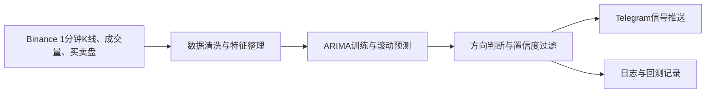

# 基于 ARIMA 模型的 10 分钟事件合约预测工具实现计划

## 1. 项目目标

本项目目标是实现一个面向 Binance 10 分钟事件合约的预测提醒工具。工具不直接自动下单，只根据公开市场数据生成“涨 / 跌 / 观望”信号，并在信号满足置信度阈值时推送到 Telegram。

核心工作流如下：



10 分钟事件合约的预测目标是判断当前开仓后，约 10 分钟到期时的价格相对开仓价格是上涨还是下跌。由于事件合约自身 API 可用性不确定，第一版工具应优先使用 Binance 公开市场数据作为预测输入，例如现货或 U 本位合约的 `BTCUSDT` 1 分钟 K 线、成交量、成交方向和盘口数据。

## 2. 运行环境约束

项目 Python 环境固定为 Anaconda 创建的 `arima-env`。后续所有终端命令都必须先激活该环境，再执行安装、训练、回测或实时运行命令。

Windows PowerShell 中的环境激活方式：

```powershell
conda activate arima-env
```

如果 PowerShell 无法识别 `conda activate`，先执行 Anaconda 初始化并重新打开终端：

```powershell
conda init powershell
```

计划使用的主要 Python 依赖包括：

- `pandas`：处理 K 线、成交量、盘口快照和回测结果。
- `numpy`：数值计算。
- `statsmodels` 或 `pmdarima`：ARIMA 建模、参数选择和预测。
- `python-binance` 或 `ccxt`：获取 Binance 行情数据。
- `websocket-client`：订阅实时行情或盘口数据。
- `python-dotenv`：读取 `.env` 中的 Telegram 和 Binance 配置。
- `requests`：调用 Telegram Bot API。
- `loguru` 或标准库 `logging`：记录运行日志。
- `pytest`：后续实现单元测试和关键流程测试。

敏感信息必须放在 `.env` 中，不应提交到 git 仓库。

## 3. 功能边界

第一版工具应该聚焦于“预测与提醒”，不实现自动交易。推荐功能边界如下：

- 支持配置交易标的，默认 `BTCUSDT`。
- 支持抓取 Binance 1 分钟 K 线数据，包括开盘价、最高价、最低价、收盘价和成交量。
- 支持获取买卖盘数据，至少包含最优买价、最优卖价、买一量、卖一量和盘口价差。
- 支持将历史数据保存到本地文件或轻量数据库，便于回测和模型重训。
- 使用 ARIMA 或 Auto ARIMA 对价格收益率或差分价格序列做滚动预测。
- 将 10 分钟预测结果转换为“涨 / 跌 / 观望”信号。
- 当预测方向明确且置信度达到阈值时，推送 Telegram 消息。
- 支持回测模式和实时模式。
- 支持日志、错误重试和运行状态监控。

不做事项：

- 不自动点击或调用事件合约下单。
- 不保证盈利。
- 不绕过 Binance 地区限制、账户限制或合规限制。
- 不把 API Key、Bot Token、Chat ID 写入代码。

## 4. 数据设计

### 4.1 数据来源

数据优先级如下：

1. Binance 官方公开 REST API：用于补齐历史 1 分钟 K 线。
2. Binance WebSocket：用于实时订阅 K 线、成交和盘口。
3. Data.Binance.Vision：用于下载更长历史数据，适合作为后续增强。
4. 第三方 Tick 或盘口数据源：作为后续优化，不纳入第一版必要范围。

### 4.2 必需数据字段

1 分钟 K 线字段：

- `timestamp`
- `open`
- `high`
- `low`
- `close`
- `volume`
- `quote_volume`
- `trade_count`
- `taker_buy_base_volume`
- `taker_buy_quote_volume`

盘口字段：

- `timestamp`
- `best_bid_price`
- `best_bid_qty`
- `best_ask_price`
- `best_ask_qty`
- `spread`
- `mid_price`
- `book_imbalance`

其中 `book_imbalance` 可定义为买一量和卖一量的相对差值，用于辅助判断盘口偏向。

### 4.3 数据存储

第一版建议使用本地 `data/` 目录保存数据：

- `data/raw/`：原始 K 线、盘口和成交数据。
- `data/processed/`：清洗后的训练数据。
- `data/backtest/`：回测结果。
- `logs/`：运行日志。

数据文件建议使用 CSV 或 Parquet。若后续数据量增大，可以迁移到 SQLite、DuckDB 或 TimescaleDB。

## 5. ARIMA 建模方案

### 5.1 建模对象

ARIMA 更适合处理平稳时间序列，因此不建议直接对原始价格建模。第一版建议优先对以下序列建模：

- 1 分钟收盘价的对数收益率。
- 或经过一阶差分后的收盘价序列。

预测目标是未来 10 分钟的累计变化方向：

- 若未来 10 分钟预测累计收益率大于正阈值，输出“涨”。
- 若未来 10 分钟预测累计收益率小于负阈值，输出“跌”。
- 若预测变化幅度不足或模型不确定性较高，输出“观望”。

### 5.2 训练方式

推荐使用滚动窗口训练：

- 每次使用最近 `N` 根 1 分钟 K 线训练或更新模型。
- `N` 初始可取 720 到 2880，即最近 12 小时到 2 天数据。
- 每分钟获得新 K 线后更新输入序列，并重新预测未来 10 分钟。
- 第一版可以每 5 到 10 分钟重新拟合一次模型，避免每分钟完整重训造成延迟。

ARIMA 阶数选择：

- 第一版可用固定参数作为基线，例如 `(p,d,q)` 在小范围内网格搜索。
- 后续可引入 `auto_arima` 自动选择参数。
- 每次选择参数时必须基于训练窗口内部数据，不允许使用未来数据。

### 5.3 置信度定义

ARIMA 本身输出的是预测值和预测区间，不直接输出分类概率。第一版可以使用综合置信度：

- 预测方向强度：未来 10 分钟累计预测收益率的绝对值。
- 噪声调整：预测收益率除以训练窗口残差标准差。
- 预测区间一致性：预测区间上下界是否都偏向同一方向。
- 市场过滤：成交量是否足够、盘口价差是否过大、盘口不平衡是否支持预测方向。
- 回测校准：最近滚动回测中同类信号的历史胜率。

示例决策规则：

- `score >= confidence_threshold` 且预测累计收益率为正：推送“涨”信号。
- `score >= confidence_threshold` 且预测累计收益率为负：推送“跌”信号。
- 其他情况：记录为“观望”，不推送开仓信号。

阈值应通过回测确定，不应主观固定。第一版可以从较保守的阈值开始，优先减少低质量信号。

## 6. 信号生成逻辑

信号对象建议包含以下信息：

- 交易标的，例如 `BTCUSDT`。
- 当前时间。
- 当前价格或中间价。
- 预测到期时间，例如当前时间后 10 分钟。
- 预测方向：`UP`、`DOWN` 或 `HOLD`。
- 预测累计收益率。
- 置信度分数。
- ARIMA 参数。
- 盘口价差。
- 成交量过滤结果。
- 风险提示。

Telegram 推送消息应简洁，但必须包含足够的交易判断信息：

- 标的。
- 信号方向。
- 当前价格。
- 预测到期时间。
- 置信度。
- 触发原因摘要。
- 提醒“不自动下单，需人工确认”。

为避免刷屏，需要加入冷却机制：

- 同一标的同一方向信号在指定分钟内只推送一次。
- 若连续信号方向反转，应额外标注“方向反转”。
- 若数据源异常或模型失败，应推送错误告警或写入日志，避免静默失效。

## 7. 回测与验收标准

实现实时推送前，必须先完成历史回测。回测需要模拟以下流程：

1. 按时间顺序读取历史 1 分钟数据。
2. 在每个可预测时间点，只使用过去数据训练和预测。
3. 生成未来 10 分钟方向信号。
4. 将预测方向与真实 10 分钟后价格方向比较。
5. 统计信号质量和策略表现。

核心指标：

- 总样本数。
- 信号数。
- 信号频率。
- 涨信号胜率。
- 跌信号胜率。
- 总胜率。
- 准确率。
- 平衡准确率。
- 最大连错次数。
- 按天统计的信号数量和胜率。
- 简化收益模拟。

第一版建议验收门槛：

- 回测逻辑无未来函数。
- 在不少于 30 天的 1 分钟数据上完成滚动回测。
- 信号胜率显著高于随机基准后，才开启实时 Telegram 推送。
- 若胜率不稳定，应降低推送频率或继续调参，不应进入实盘提醒。

## 8. 项目目录建议

后续实现代码时，建议使用以下目录结构：

```text
event/
  config/
    settings.example.env
  data/
    raw/
    processed/
    backtest/
  docs/
    基于ARIMA模型的10分钟事件合约预测工具的实现plan.md
  logs/
  src/
    data/
    features/
    models/
    signals/
    notify/
    backtest/
    utils/
  tests/
  README.md
  requirements.txt
```

这只是实现建议，不要求在本文档创建阶段生成代码。

## 9. 实施阶段

### 阶段 1：项目骨架与配置

目标：

- 创建 Python 项目结构。
- 添加 `.env.example`。
- 明确所有命令都在 `arima-env` 中执行。
- 建立统一配置读取方式。

验收：

- 能读取交易标的、时间周期、Telegram 配置和阈值配置。
- 敏感配置不会进入 git。

### 阶段 2：历史数据采集

目标：

- 从 Binance 获取 1 分钟 K 线。
- 支持指定标的、开始时间、结束时间。
- 保存到本地 `data/raw/`。

验收：

- 能下载至少 30 天 `BTCUSDT` 1 分钟数据。
- 数据字段完整、时间连续、无明显重复。

### 阶段 3：实时数据采集

目标：

- 使用 REST 轮询或 WebSocket 获取最新 1 分钟 K 线。
- 获取买卖盘最优价、最优量和价差。
- 将实时数据追加到本地。

验收：

- 能持续运行并记录最新数据。
- 断线后有重试机制。

### 阶段 4：特征与标签

目标：

- 构造收益率、差分价格、滚动波动率、成交量变化和盘口不平衡。
- 构造未来 10 分钟方向标签，用于回测评估。

验收：

- 所有特征只使用当前及过去数据。
- 标签只用于回测，不进入实时预测输入。

### 阶段 5：ARIMA 模型

目标：

- 训练 ARIMA 模型。
- 支持固定阶数和可选自动选参。
- 输出未来 10 分钟累计预测方向、预测幅度和置信度基础信息。

验收：

- 能在历史数据上滚动预测。
- 模型失败时能记录原因并跳过该轮，不导致主程序崩溃。

### 阶段 6：信号引擎

目标：

- 将 ARIMA 预测结果转换为 `UP`、`DOWN`、`HOLD`。
- 加入成交量、盘口价差和冷却时间过滤。
- 生成结构化信号记录。

验收：

- 低置信度预测不会推送。
- 信号频率可通过配置控制。

### 阶段 7：Telegram 推送

目标：

- 接入 Telegram Bot API。
- 支持发送信号消息和异常告警。
- 支持启动时发送健康检查消息。

验收：

- 使用测试 Bot 能收到消息。
- Token 或 Chat ID 缺失时给出清晰错误。

### 阶段 8：回测与调参

目标：

- 实现无未来函数的滚动回测。
- 输出指标报表。
- 根据回测结果调整置信度阈值和过滤规则。

验收：

- 生成可读的回测结果文件。
- 能对比不同 ARIMA 参数、不同窗口长度和不同阈值。

### 阶段 9：实时运行与文档

目标：

- 提供实时运行入口。
- 完成 README 使用说明。
- 明确风险提示和人工确认流程。

验收：

- 在 `arima-env` 中可按文档步骤运行。
- Telegram 能收到实时信号或健康检查消息。

## 10. 给 Cursor 顺序执行的 Prompts

以下 prompts 可在后续实现阶段逐条交给 Cursor 执行。建议每执行完一条，都先运行测试或最小验证，再进入下一条。

### Prompt 1：创建项目骨架

```text
请基于 docs/基于ARIMA模型的10分钟事件合约预测工具的实现plan.md 创建 Python 项目骨架。不要实现完整业务逻辑，只创建目录、README 初稿、requirements.txt、.env.example 和基础配置模块。项目环境是 Anaconda 的 arima-env，README 中所有命令都必须先提示 conda activate arima-env。不要提交 git commit。
```

### Prompt 2：实现配置读取

```text
请实现统一配置读取模块，支持从 .env 读取 Binance 数据源配置、交易标的、K线周期、预测窗口、ARIMA 参数、置信度阈值、Telegram Bot Token 和 Chat ID。敏感信息不能写死。请补充配置校验和对应测试。
```

### Prompt 3：实现历史 K 线下载

```text
请实现 Binance 1 分钟 K 线历史数据下载功能，支持 symbol、start、end 参数，将数据保存到 data/raw/。需要处理分页、限频、重复数据和时间连续性检查。请提供在 arima-env 中运行的命令示例，并补充最小测试。
```

### Prompt 4：实现实时行情和盘口采集

```text
请实现实时行情采集模块，获取 Binance 1 分钟 K 线和买卖盘最优价量。可以先使用 REST 轮询，接口设计要允许后续替换为 WebSocket。需要保存数据、记录日志、处理网络异常和重试。
```

### Prompt 5：实现特征与标签生成

```text
请实现特征工程模块：基于 1 分钟 K 线生成 log return、差分价格、滚动波动率、成交量变化率、盘口价差、盘口不平衡等字段；同时为回测生成未来 10 分钟涨跌标签。请严格避免未来数据泄露，并写测试覆盖关键边界。
```

### Prompt 6：实现 ARIMA 预测模块

```text
请实现 ARIMA 预测模块，输入最近 N 根 1 分钟数据，使用收益率或差分价格序列训练模型，输出未来 10 分钟累计预测收益、方向、预测区间、残差波动和模型参数。支持固定 (p,d,q) 和可选 auto_arima。模型失败时返回可诊断错误，不要让主流程崩溃。
```

### Prompt 7：实现信号引擎

```text
请实现信号引擎，把 ARIMA 预测结果转换为 UP、DOWN、HOLD。信号需要结合预测幅度、残差波动、预测区间、成交量过滤、盘口价差过滤、盘口不平衡和冷却时间计算置信度。只有置信度达到阈值才生成 Telegram 推送信号。请补充测试。
```

### Prompt 8：实现 Telegram 推送

```text
请实现 Telegram 通知模块，使用 Bot Token 和 Chat ID 推送信号消息、启动健康检查消息和异常告警。消息内容需要包含 symbol、方向、当前价格、预测到期时间、置信度、触发原因和人工确认提示。不要在代码中写死任何敏感信息。
```

### Prompt 9：实现滚动回测

```text
请实现滚动回测模块，按时间顺序模拟每一分钟的预测，只允许使用过去数据训练 ARIMA，并用未来 10 分钟真实方向评估结果。输出信号数、信号频率、胜率、平衡准确率、最大连错、按日胜率和简化收益模拟。请确保没有未来函数。
```

### Prompt 10：实现实时运行入口

```text
请实现实时运行入口，持续获取最新 Binance 数据，更新 ARIMA 预测，调用信号引擎，并在满足阈值时推送 Telegram。需要有日志、异常重试、优雅退出和 dry-run 模式。README 中补充完整运行命令，所有命令都必须在 arima-env 中执行。
```

### Prompt 11：完善测试、文档和风控说明

```text
请补充测试、README 和风险说明。README 需要包含环境准备、.env 配置、历史数据下载、回测、实时运行、Telegram 测试、日志查看和常见问题。风险说明必须强调该工具只提供预测提醒，不构成投资建议，也不自动下单。
```

## 11. 工具完成后的使用方法

以下是工具完成后的预期使用流程，供后续 README 实现时参考。

### 11.1 激活环境

每次打开终端后，先进入项目目录并激活环境：

```powershell
cd C:\dev\program\event
conda activate arima-env
```

### 11.2 安装依赖

```powershell
pip install -r requirements.txt
```

### 11.3 准备配置

复制示例配置：

```powershell
copy config\settings.example.env .env
```

在 `.env` 中填写：

- `SYMBOL=BTCUSDT`
- `INTERVAL=1m`
- `PREDICTION_MINUTES=10`
- `ARIMA_ORDER=1,0,1`
- `TRAIN_WINDOW=1440`
- `CONFIDENCE_THRESHOLD=0.70`
- `TELEGRAM_BOT_TOKEN=你的 Telegram Bot Token`
- `TELEGRAM_CHAT_ID=你的 Telegram Chat ID`
- `DRY_RUN=true`

如果只使用公开行情数据，Binance API Key 可以不是第一版必需项。若后续接入更高限额或私有接口，再加入 Key 管理。

### 11.4 下载历史数据

```powershell
python -m src.data.download_klines --symbol BTCUSDT --interval 1m --start 2026-01-01 --end 2026-02-01
```

下载后检查：

- `data/raw/` 中是否生成数据文件。
- 时间戳是否连续。
- 是否存在重复 K 线。
- 收盘价、成交量是否为空。

### 11.5 运行回测

```powershell
python -m src.backtest.run_backtest --symbol BTCUSDT --data data/raw/BTCUSDT_1m.csv --prediction-minutes 10
```

回测结束后查看：

- `data/backtest/` 中的结果文件。
- 总信号数量是否过少或过多。
- 胜率是否显著高于随机基准。
- 最大连错是否可以接受。
- 信号是否集中在少数极端行情中。

若回测不稳定，应先调低交易频率或提高置信度阈值，不应开启实时提醒。

### 11.6 测试 Telegram

```powershell
python -m src.notify.telegram --test
```

如果没有收到消息，依次检查：

- Bot Token 是否正确。
- Chat ID 是否正确。
- 是否已经向 Bot 发送过 `/start`。
- 当前网络是否能访问 Telegram API。

### 11.7 实时运行

建议先用 dry-run 模式运行：

```powershell
python -m src.app --mode live --dry-run
```

确认数据、模型和日志正常后，再允许推送真实 Telegram 信号：

```powershell
python -m src.app --mode live
```

实时运行时应关注：

- 是否每分钟更新数据。
- 是否有 API 限频或断线。
- 是否持续出现模型拟合失败。
- Telegram 信号是否过于频繁。
- 信号方向是否与回测表现一致。

### 11.8 日志查看

日志建议写入：

```text
logs/app.log
logs/data.log
logs/model.log
logs/signal.log
logs/telegram.log
```

出现异常时优先查看：

1. 数据采集日志。
2. 模型拟合日志。
3. 信号过滤日志。
4. Telegram 推送日志。

### 11.9 日常维护

建议维护节奏：

- 每日检查实时运行日志和 Telegram 推送状态。
- 每周用最新数据重新回测一次。
- 每月重新评估 ARIMA 参数、训练窗口和置信度阈值。
- 遇到剧烈行情、交易所接口变化或信号连续失效时，暂停实时提醒并重新回测。

## 12. 测试方案

项目使用 `pytest`，所有测试命令均在 `arima-env` 中执行。

### 12.1 运行方式

```powershell
conda activate arima-env
cd C:\dev\program\event
pytest
```

按模块运行示例：

```powershell
pytest tests/test_config.py -v
pytest tests/test_backtest.py -v
pytest tests/test_telegram.py -v
```

### 12.2 测试覆盖范围

| 模块 | 测试文件 | 覆盖要点 |
|------|----------|----------|
| 配置 | `tests/test_config.py` | `.env` 解析、校验、敏感项缺失 |
| 历史下载 | `tests/test_download_klines.py` | 分页、去重、时间连续性 |
| 实时采集 | `tests/test_collect_live.py` | REST 轮询、盘口字段、重试 |
| 特征工程 | `tests/test_features.py` | 无未来泄露、标签边界 |
| ARIMA | `tests/test_arima_predictor.py` | 固定阶数预测、失败降级 |
| 信号引擎 | `tests/test_signal_engine.py` | 置信度、冷却、价差过滤 |
| 滚动回测 | `tests/test_backtest.py` | 无未来函数、指标汇总 |
| Telegram | `tests/test_telegram.py` | 消息格式、重试、dry-run |
| 实时循环 | `tests/test_live_runner.py` | 单轮预测、健康检查 |
| 应用入口 | `tests/test_app.py` | CLI、dry-run 解析、单轮冒烟 |

Telegram 与 Binance HTTP 调用在测试中默认 **mock**，不向真实 API 发请求。

### 12.3 验收标准

- 全量 `pytest` 通过。
- 特征与回测测试能拦截未来数据泄露。
- Telegram 消息模板包含「不自动下单」「人工确认」文案。
- 新增模块应同步补充对应 `tests/test_*.py`。

## 13. README 与文档

项目根目录 `README.md` 为使用主文档，需包含以下章节（已实现）：

1. **环境准备**：Conda 创建/激活 `arima-env`、安装依赖、验证。
2. **`.env` 配置**：复制 `.env.example`、变量说明表、最小配置示例。
3. **历史数据下载**：`download_klines` 命令与下载后检查项。
4. **回测**：`run_backtest` 命令、结果解读、上线前门槛。
5. **实时运行**：dry-run → 真实推送的两步流程与 CLI 参数。
6. **Telegram 测试**：Token/Chat ID 获取、`telegram --test` 命令。
7. **日志查看**：`logs/*.log` 分工与排查顺序。
8. **测试**：`pytest` 全量与分模块命令。
9. **常见问题**：conda、限频、回测、模型失败、Telegram、无信号等。
10. **风险提示**：摘要并链接 `docs/RISK_DISCLAIMER.md`。

## 14. 风险提示与免责声明

**核心声明（必须在 README 与风险文档中醒目展示）：**

> **本工具只提供预测提醒，不构成投资建议，也不自动下单。**

完整条款见 [docs/RISK_DISCLAIMER.md](RISK_DISCLAIMER.md)。摘要如下：

### 14.1 工具定位

- 仅根据公开市场数据输出「涨 / 跌 / 观望」类 **预测提醒**。
- 置信度达标时通过 Telegram 通知用户。
- **不**连接任何下单接口，**不**代替用户完成开仓、平仓或资金操作。

### 14.2 不构成投资建议

- 所有输出均为统计模型推断，不代表对未来价格的承诺或推荐。
- 历史回测胜率不保证未来有效。
- 用户须在充分理解风险后 **人工确认** 每一条信号。

### 14.3 技术与合规局限

- ARIMA 对短周期加密市场的突发消息、非线性波动和盘口冲击捕捉能力有限。
- 回测必须无未来函数；样本过短或参数过拟合会导致虚高胜率。
- 用户自行承担事件合约参与风险，遵守当地监管与 Binance 服务条款。
- 敏感配置仅存于 `.env`，不得提交 git。

### 14.4 运营原则

第一版以「少发、准发、可解释」为原则。宁可输出更多「观望」，也不要为提高信号数量而降低置信度门槛。出现异常行情、连续失效或接口变更时，应暂停实时提醒并重新回测。
